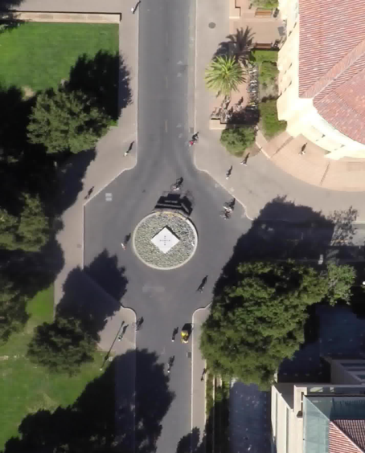

# Aerial Images Detection Using RetinaNet in PyTorch

Pytorch  implementation of RetinaNet object detection as described in [Focal Loss for Dense Object Detection](https://arxiv.org/abs/1708.02002) by Tsung-Yi Lin, Priya Goyal, Ross Girshick, Kaiming He and Piotr Dollár.

This implementation is primarily designed to be easy to read and simple to modify.

## Installation

1) Clone this repository `git clone url`
   
2) Install the required packages `apt-get install tk-dev python-tk`

3) Install the python packages:
```
pip install pandas
pip install pycocotools
pip install opencv-python
pip install requests
```

## DataSet
We used [the Stanford Drone Datasets](https://cvgl.stanford.edu/projects/uav_data/) for training.
See sample images below.
<p align="left"> </p>  

## Training

The network can be trained using the `train.py` script. Currently, two dataloaders are available: CSV. For training in CSV format, use

```bash
python train.py --dataset csv --csv_train <path/to/train_annots.csv>  --csv_classes <path/to/train/class_list.csv>  --csv_val <path/to/val_annots.csv>
# example :
python train.py --dataset csv --csv_train snapshots/train_annotations.csv --csv_classes snapshots/labels.csv --csv_val snapshots/val_annotations.csv
```

Note that the --csv_val argument is optional, in which case no validation will be performed.

## Demo
Red and blue boxes represent pedestrian and bikers, respectively.
<p align="center">></p> 

```bash
python demo.py --dataset csv --csv_classes snapshots/labels.csv --csv_test snapshots/test_annotations.csv --model trained_data/model_final.pt
```


## Pre-trained model

A pre-trained model is available at: 
- https://drive.google.com/open?id=1yLmjq3JtXi841yXWBxst0coAgR26MNBS (this is a pytorch state dict)

The state dict model can be loaded using:

```
retinanet = model.resnet50(num_classes=dataset_train.num_classes(),)
retinanet.load_state_dict(torch.load(PATH_TO_WEIGHTS))
```

## Model

The retinanet model uses a resnet backbone. You can set the depth of the resnet model using the --depth argument. Depth must be one of 18, 34, 50, 101 or 152. Note that deeper models are more accurate but are slower and use more memory.

## CSV datasets
The `CSVGenerator` provides an easy way to define your own datasets.
It uses two CSV files: one file containing annotations and one file containing a class name to ID mapping.

### Annotations format
The CSV file with annotations should contain one annotation per line.
Images with multiple bounding boxes should use one row per bounding box.
Note that indexing for pixel values starts at 0.
The expected format of each line is:
```
path/to/image.jpg,x1,y1,x2,y2,class_name
```

Some images may not contain any labeled objects.
To add these images to the dataset as negative examples,
add an annotation where `x1`, `y1`, `x2`, `y2` and `class_name` are all empty:
```
path/to/image.jpg,,,,,
```

A full example:
```
/data/imgs/img_001.jpg,837,346,981,456,cow
/data/imgs/img_002.jpg,215,312,279,391,cat
/data/imgs/img_002.jpg,22,5,89,84,bird
/data/imgs/img_003.jpg,,,,,
```

This defines a dataset with 3 images.
`img_001.jpg` contains a cow.
`img_002.jpg` contains a cat and a bird.
`img_003.jpg` contains no interesting objects/animals.


### Class mapping format
The class name to ID mapping file should contain one mapping per line.
Each line should use the following format:
```
class_name,id
```

Indexing for classes starts at 0.
Do not include a background class as it is implicit.

For example:
```
cow,0
cat,1
bird,2
```


## Acknowledgements

- Significant amounts of code are borrowed from the [keras retinanet implementation](https://github.com/fizyr/keras-retinanet)
- The NMS module used is from the [pytorch faster-rcnn implementation](https://github.com/ruotianluo/pytorch-faster-rcnn)

## License
- The Stanford Drone Datasets are under the [Creative Commons Attribution-NonCommercial-ShareAlike 3.0 License](https://creativecommons.org/licenses/by-nc-sa/3.0/)

